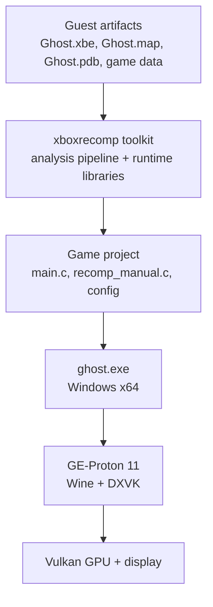
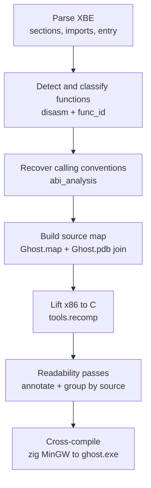
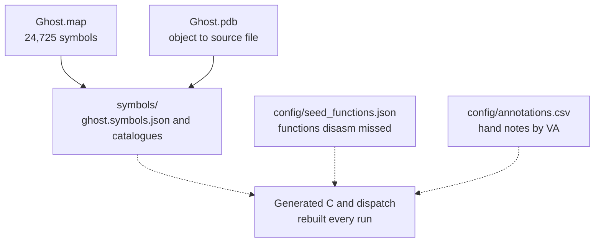
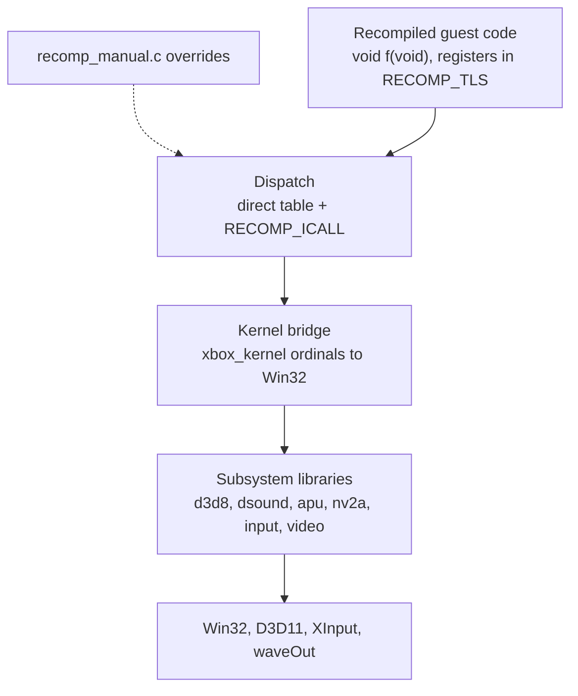
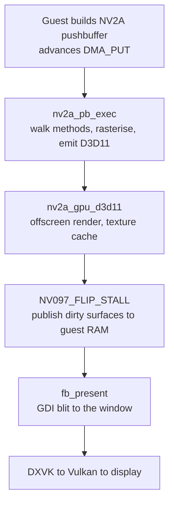
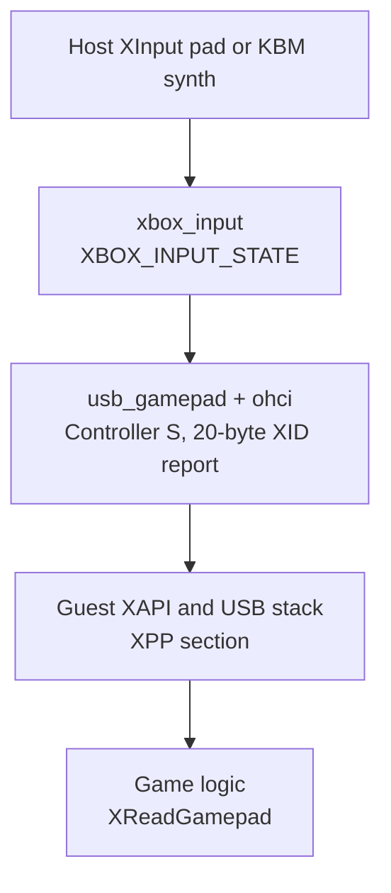
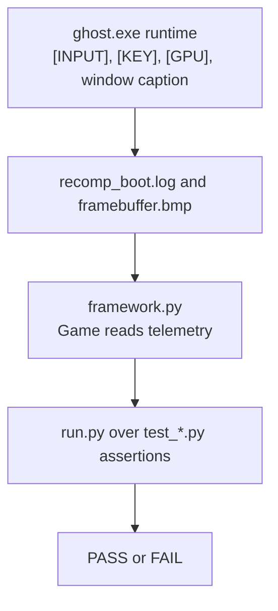
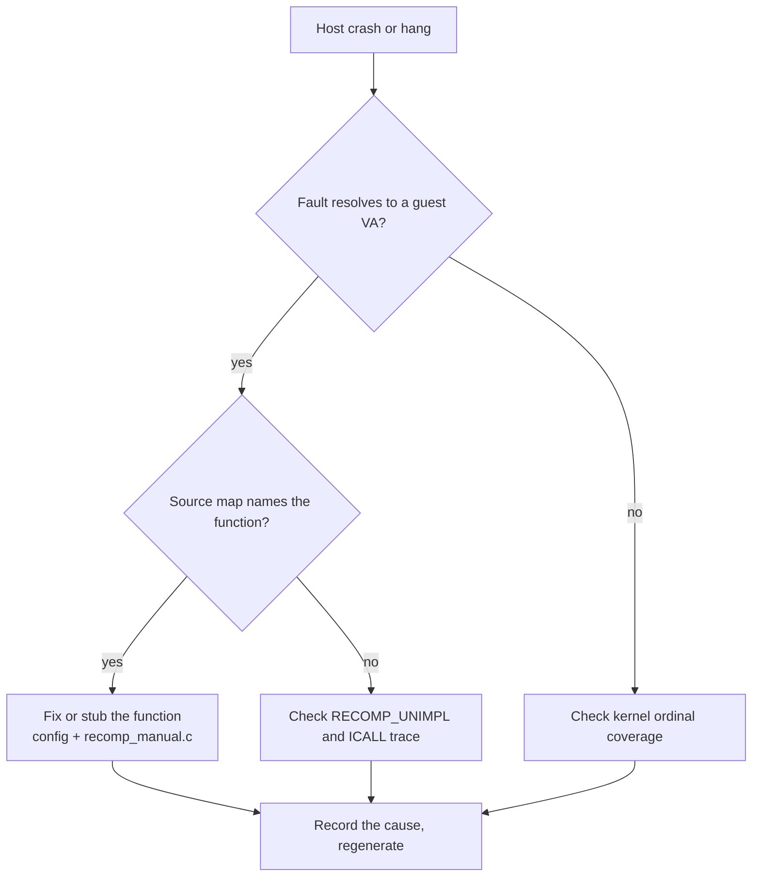

# 10 - Architecture of the static recompilation

This document describes the whole static-recompilation effort as a system: what
the parts are, how work flows through them, where the complexity lives, and
which problems are known. It is written to support complexity and problem
analysis, not as a tutorial. The pipeline tutorials live in
[../README.md](../README.md), the strategy in [05-strategy.md](05-strategy.md),
and the per-topic notes in the sibling documents.

The effort replaces one emulated machine with two things built ahead of time: a
lifter that turns the guest x86 into C, and a runtime that answers every Xbox
hardware and kernel call the guest makes, in host code. There is no CPU
emulator at run time; the guest's own instructions execute as native code.

## System context

Who talks to whom at the highest level.

The guest artifacts are read-only inputs. The toolkit produces both the
generated guest code (through its pipeline) and the runtime libraries the
executable links against. The game project is the thin, committing layer: the
host entry point, the manual override hook, and the data files. `ghost.exe` is
the only artifact that runs; everything upstream of it exists to produce it.

## Component map

| Path | Role | Kind |
|---|---|---|
| `extracted/StarCraft Ghost Xbox Finn Hillbilly/` | The guest XBE, MAP, PDB and game data | gitignored input |
| `refs/xboxrecomp` | The toolkit: analysis pipeline and runtime libraries | gitignored clone of the fork |
| `recomp/tools/` | Our pipeline extensions: symbol map, annotate, group, catalog | committed |
| `recomp/symbols/` | Our source map and catalogues (data, not code) | committed |
| `recomp/config/` | Seeds and hand annotations (data) | committed |
| `recomp/build/` | Pipeline analysis output and generation workspace | gitignored |
| `recomp/game/` | The game project: CMake, `main.c`, `recomp_manual.c` | committed |
| `recomp/game/src/recomp/gen/` | Generated guest C and dispatch, compiled into the exe | gitignored |
| `recomp/game/build/ghost.exe` | The build output that runs | gitignored |
| `recomp/tests/` | The out-of-process test framework and test modules | committed |
| `scripts/` | Launch, stop, log, toolkit setup, helpers | committed |
| `Makefile` | The operator surface: build, test, launch, stop | committed |

Two directions share the repository. The root project (Cxbx-Reloaded under
Proton) was the original approach; `recomp/` is the replacement described here.
Root `docs/00` through `docs/06` cover the emulator direction and the leak; the
recompilation has its own `recomp/docs/`.

## The target guest binary

| Field | Value |
|---|---|
| Title | StarCraft: Ghost (Release), debug-type XBE |
| XBE | `Ghost.xbe`, 4.90 MB, base `0x00010000` |
| Entry point | `0x001B3FBB` (mainCRTStartup) |
| XDK | 5659 |
| Sections | 32 (`text`, D3D, D3DX, DSOUND, XACTENG, BINK*, XNET, XPP, WMADEC, XGRPH, DOLBY, data) |
| Kernel imports | 137 ordinals |
| Statically linked XDK | XAPILIB, D3D8, D3DX8, DSOUND, XACTENG, XBOXKRNL, LIBCMT, LIBC, XGRAPHC, XKBD, XNET |

The decisive asset is that the drop shipped `Ghost.map` and `Ghost.pdb` beside
the XBE. The MAP resolves to this XBE's entry point, so its 24,725 symbols are
trustworthy for this binary, and the PDB maps each defining object to its
original `c:/star/code/...` source file. That converts the hardest part of a
recompilation, naming and locating functions, into a data join. See
[04-source-map.md](04-source-map.md).

## Build pipeline

The path from the XBE to the generated C, for one build. Every stage is
mechanical; nothing here is hand-edited.

| Stage | Tool | Output | Measured result |
|---|---|---|---|
| Parse | `tools.xbe_parser` | `build/analysis.json` | 32 sections, 137 imports, XDK 5659 |
| Detect | `tools.disasm` | `build/disasm/*.json` | 17,307 functions, 1,168,971 instructions, 211,228 xrefs |
| Classify | `tools.func_id` | `build/func_id/*` | 14,547 game, 12,228 vtable methods, 8,891 unknown |
| ABI | `tools.abi_analysis` | `build/abi/*` | 4,393 `thiscall`, C++ heavy |
| Source map | `recomp/tools/build_symbol_map.py` | `recomp/symbols/*` | 16,114 names (93.1%), 9,067 sourced (52.4%), 222 files |
| Names | `recomp/tools/apply_symbol_map.py` | `functions.json` in place | overwrites `sub_*` placeholders |
| Lift | `tools.recomp --all --split 250` | `build/gen/recomp_NNNN.c` | 17,308 functions, 2.20 M lines, 0 failed |
| Readability | `annotate_gen.py` + `group_by_source.py` | `build/gen_by_source/*.c` | 223 source-file units |
| Cross-compile | `cmake` + zig `x86_64-w64-mingw32` | `ghost.exe` | Windows x64 |

`group_by_source.py` is a reading aid only: the build compiles either the
chunked `game/src/recomp/gen/*.c` or the per-source tree, never both, because
they define the same symbols.

## Knowledge stays in data

The core discipline is that the generated C is disposable and all understanding
is data. Regeneration must be free and repeatable, and must not need a patch.

Legend: solid arrows are data writes; dashed arrows are configuration or
read-only inputs to generation.

Rules the pipeline follows:

- Names and source attribution come from the MAP and PDB, joined onto detected
  functions, not from a proprietary decompiler.
- Hand knowledge lives in `config/` keyed by guest VA; it is injected as banner
  comments, never as edits to generated files.
- Seeds in `config/seed_functions.json` patch function detection where the
  disassembler missed an entry point (the USB/XID init path is the reason they
  exist).
- Regeneration rescrapes `build/` and `game/src/recomp/gen/`; nothing
  hand-written lives there.

## The runtime boundary

The guest runs as C. Registers are thread-local globals, not host registers, so
every recompiled function is `void f(void)` and reads and writes `g_eax`,
`g_esp`, and so on. Memory access is `MEM32(ecx + 0x6DF0)`, and flag state is
tracked explicitly. This is a faithful literal translation, not readable
decompiled C; the banners and grouped files make it navigable.

The two lookup callbacks are the integration seam:

- `recomp_lookup` is the generated dispatch table for direct calls.
- `recomp_lookup_manual` is our override hook, consulted first, keyed by guest
  VA. It is where a faulting or untranslated function gets fixed or stubbed.

Boot sequence in `recomp/game/src/main.c`: detach console and redirect stdio to a
log; set runtime environment; load the XBE; map the Xbox address space; bring up
the emulated APU; init kernel, paths, bridge, input and OHCI; install the NV2A
software-method handler; set the guest stack; init flat dispatch; start the
watchdog; call `mainCRTStartup_001B3FBB`. A vectored exception handler routes
OHCI and APU MMIO faults back into the runtime and, when the fault is a real
crash, dumps guest registers, a scanned guest stack, and the recent ICALL ring.

## Graphics frame path

There is no D3D11 swapchain. The guest D3D8 is HLE'd at the API boundary, the
runtime renders offscreen, and every flip reads the dirty surfaces back into
guest RAM, which the visible window then blits. That round trip is the frame's
structural cost.

Measured at the menu, the dominant costs were re-hashing textures on every bind
and blocking on GPU readback. Both have targeted fixes that are now default; see
[09-performance.md](09-performance.md) for the budget and the fixes.

## Input path

The title carries the Xbox XAPI USB stack in its own XPP section and samples the
pad through the Peripheral Port, so the runtime only has to present a
controller there. A `--kbm` mode synthesises pad state for keyboard and mouse.

The seam is deliberate: `usb_gamepad.c` links directly against
`xbox_InputGetState`, so input must be implemented in the runtime, not wrapped
in the game project. Full detail and the remaining gaps are in
[08-input.md](08-input.md).

## Concurrency

| Thread | Created by | Role |
|---|---|---|
| Guest thread 1 | first `PsCreateSystemThreadEx`, run inline | the game starting; also drives the D3D11 executor |
| Guest thread 2 | `kernel_bridge.c` | second guest thread, own TLS register file, stack and TIB |
| OHCI | `ohci.c` | controller, 4 ms tick |
| Kernel timer | `kernel_bridge.c` | guest timers and DPCs |
| NV2A ack | `xbox_memory_layout.c` | interrupt ack |
| Watchdog | `xbox_memory_layout.c` | hang reporting |
| Framebuffer window | `fb_present.c` | GDI window and blit |
| Video pump | `video_pump.c` | overlay video |
| APU / waveOut | `apu_shim.h` | audio out |

The two guest threads are real and run on two host threads. Recompiled code
keeps its registers in thread-local storage, so guest concurrency is genuinely
concurrent. The measured contention on the single guest critical section is
mild; the frame time is inside the renderer, not in scheduling.

## Verification and telemetry

Testing is out-of-process. The framework launches or attaches to `ghost.exe`,
injects X11 events with XTEST, and asserts on what the runtime reports. Nothing
needs a human at the keyboard.

Five observation channels make a test able to say what happened rather than only
that nothing crashed: injected input, the `[INPUT]` synthesized-state sample,
the `[KEY]` window edge log, the window caption frame and FPS counters, the F12
framebuffer hash for scene comparison, and the `[GPU-D3D11]` summary for shader,
texture and CPU-fallback health. `xinject.py` is a general X11 injector; all
game knowledge stays in `test_*.py`.

## The debugging loop

Bring-up is one crash at a time. The decision below is the standard triage for a
new failure.

The instruments that feed this are the VEH guest-stack and ICALL dump in
`main.c`, the `[ICALL]` logs and `recomp_unimpl` in `recomp_manual.c`, the
watchdog, and `RECOMP_UNIMPL_TRAP=1` to stop at the first untranslated
instruction at its own guest address instead of wherever the damage surfaces.

## Operating it

| Task | Command |
|---|---|
| Build the exe | `make build` (runs `recomp/game/build.sh`) |
| Launch for hands-on testing | `make` (default target) |
| Run the whole test suite | `make test` |
| One test group | `make test-input`, `make test-mouse`, `make test-gameplay` |
| Scene fingerprint | `make scene` |
| Stop the game and wineserver | `make stop` |
| Tail the runtime log | `make log` |
| Get or update the toolkit fork | `make toolkit` |

The launcher defaults match what the test framework uses: keyboard and mouse,
input diagnostics, and a per-run timestamped log. The repeating watchdog and the
vblank override are opt-in (`WATCH=1`, `VBLANK=1`) because the watchdog can wedge
a load.

## Complexity analysis

Where the difficulty actually sits, ranked by the cost of a wrong answer.

| Driver | Why it is hard | Blast radius |
|---|---|---|
| Lifter correctness for x86, x87, SSE | A wrong flag or width is silent and only shows as a dead branch; the toolkit's own changelog is a catalogue of exactly this | Any gameplay path |
| Indirect calls and vtables | 12,228 vtable methods and 1,193 unnamed functions; a wrong target is a wild call | Crashes, hangs |
| Statically linked D3D8 | The guest carries its own D3D; the HLE-versus-register-level boundary is an architectural fork | Entire renderer |
| NV2A pushbuffer translation | Register-combiner and vertex microcode translation plus a readback-based present; 50 distinct unhandled methods observed | Frame time, visuals |
| Kernel and CRT state | TIB fields, IRQL and SEH must match what the guest expects; `fs:[0x24]` errors ran the CRT fatal path 44,000 times a boot | Boot, timing |
| Two guest threads with TLS registers | Guest semantics assume exactly these two; workers that touch guest code need a stack and TIB | Race conditions |
| Missing decoders | BINK FMV and WMADEC have no runtime counterpart | Cutscenes, some audio |
| Cross-compilation of MSVC-era C | `recomp_types.h` leans on MSVC; MinGW needs compile-time constant patches for D3D11 | Build only |

Coupling is the second axis. The exe couples tightly to a specific toolkit
commit: the runtime headers, the register model, the dispatch ABI, and the
driver fixes all live in the fork, so `ghost.exe` cannot be rebuilt from plain
upstream. The game project itself is intentionally thin; almost all behavior is
either generated from the XBE or supplied by the runtime.

## Problem analysis

Confirmed problems and debts, each with the evidence and a disposition.

### Faithful defects still open

- **Remaining IRQL mismatches.** The ISR fix removed the dominant `KeBugCheck`
  loop, but a few device IRQLs (3, 4, 5) are not modelled, so around 25
  mismatches remain per boot. Correctness debt behind the CRT path.
- **Unhandled NV2A methods.** 31,304 submissions fall to the unhandled counter
  across 50 distinct methods, three of them unnamed. Most are benign render
  state, but they are unclassified.
- **Unnamed functions.** 1,193 detected functions have no name, mostly thunks
  between vtable methods. They resolve by address at run time but not in a crash
  stack.

### Architectural debts

- **Hardcoded guest addresses in `main.c`.** The D3D method handler
  (`0x002C99B0`, `0x002D3D78`) and the fence address (`0x002D2148`) are raw
  constants in the host entry point. The strategy documents call for these to
  live in a `config/fixups.toml` as data. That file does not exist, so the plan
  is unmet and per-title knowledge is leaking back into C.
- **The override layer is unbuilt.** `recomp_manual.c` is still the toolkit's
  template: `recomp_lookup_manual` returns null, and there are no overrides. The
  documented `config/overrides.toml` and `config/annotations.toml` do not exist.
  `config/` holds only `annotations.csv` (5 notes) and `seed_functions.json`
  (14 seeds). The data-driven override design is designed but not constructed.
- **A 173 MB `generated.patch` is present** in `recomp/build/`. No script or the
  build references it; it is a leftover of the reference port's patch workflow
  that this project explicitly set out to avoid. Keeping it invites re-adopting
  the anti-pattern.
- **Strong toolkit coupling.** The runtime work (rumble, KBM, mouse, driver
  fixes, sync and texture fixes) is committed on the
  `Modded-Software/xboxrecomp` fork, not here. The setup script fast-forwards a
  branch, so there is no pinned revision; a fork change can move the runtime
  under a working build.

### Documentation drift

- `recomp/README.md` status says "generation/runtime bring-up not started",
  which is false: `ghost.exe` builds, boots to menus and a mission, and the test
  suite passes. The status table predates the runtime work.
- `docs/05-strategy.md` and `docs/06-open-questions.md` describe phases as
  pending (first generation, first cross-build, first Proton run) that have
  happened, and reference config files that were never created.
- The root `README.md` still leads with the Cxbx/emulator direction; the
  recompilation, which is the active direction, is one directory down.

### Portability and operations

- **Hardcoded absolute roots.** `build.sh`, `framework.py`, and several scripts
  hardcode `/home/agent/WORKSPACE-VM/projects/xbox-on-deb`. Correct for this
  machine, wrong for any other.
- **No CI for the recomp tests.** They launch a GPU game under Proton and drive
  X11, so they cannot run in a plain headless job; there is no lighter unit tier
  for the pure pipeline tools.
- **The PDB types are blocked.** `Ghost.pdb` is a VC7.1-era V70 TPI that LLVM 18
  refuses, so field offsets are `MEM32(ecx + offset)` and class layouts are
  unavailable. Source line numbers are also absent. This caps readability.

## Recommendations, ranked

1. **Stand up the data-driven override layer.** Create `config/overrides.toml`
   and `config/fixups.toml`, move the `main.c` D3D and NV2A addresses and the
   boot constants into them, and have the game project read them. This retires
   the largest design debt and matches what the strategy already promises.
2. **Delete or quarantine `build/generated.patch`.** The build does not use it.
   Keeping a 173 MB patch in the pipeline directory is how the reference port's
   mistake gets copied by accident.
3. **Pin the toolkit.** Record the fork commit that the current `ghost.exe` was
   built against, and have `19-setup-toolkit.sh` respect it instead of tracking
   the branch tip.
4. **Fix the status and phase documents.** Correct `recomp/README.md` and the
   phase checklists to the actual state so the docs stop contradicting the
   build.
5. **Name the three unmapped NV2A methods** and decide whether any affect
   pipeline state; the rest can stay counted.
6. **Recover types and line numbers** by running a Windows PDB reader under the
   existing Proton prefix, or a minimal V70 TPI reader; this is the biggest
   remaining readability gain.
7. **Add a headless test tier** for the committed pipeline tools (`build_symbol_map`,
   `annotate_gen`, `group_by_source`, `apply_symbol_map`) so regressions there do
   not require launching the game.
8. **De-hardcode the repository root** behind an environment variable across
   `build.sh`, `framework.py`, and `scripts/`.

## References

- [00-overview.md](00-overview.md), [05-strategy.md](05-strategy.md),
  [06-open-questions.md](06-open-questions.md): the plan and its risks.
- [04-source-map.md](04-source-map.md), [07-decomp-workflow.md](07-decomp-workflow.md):
  the symbol map and readability pipeline.
- [08-input.md](08-input.md), [09-performance.md](09-performance.md): input and
  frame-time analysis.
- [03-library-and-symbol-catalogue.md](03-library-and-symbol-catalogue.md):
  runtime coverage against the binary's imports.
- `refs/xboxrecomp/docs/technical/`: register model, memory layout, indirect
  calls, D3D and NV2A translation, kernel replacement, SEH.
