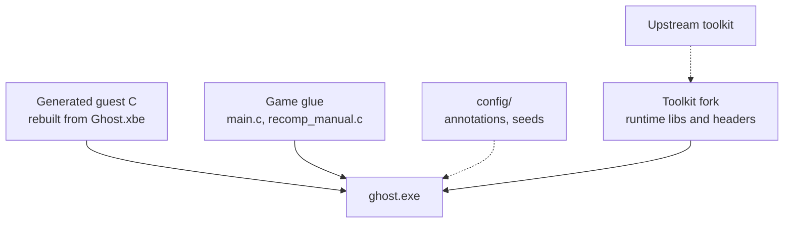

# 11 - Audit: complexity and problems

This is a point-in-time assessment of the static recompilation. It records where
the complexity concentrates, what is known to be broken or unfinished, and what
to do about it, in that order. The system itself is described in
[10-architecture.md](10-architecture.md); this document does not repeat the
design.

Method: static reading of the tree, the committed data files, and the existing
documents, combined with the runtime's own counters and reports already recorded
in the sibling documents. It is not the result of a fresh runtime session; where
a number is quoted it comes from the measurement cited in the text. Scope is the
`recomp/` direction only. The emulator direction at the repository root is out
of scope.

## Complexity

Where the difficulty sits, ranked by the cost of a wrong answer.

| Driver | Why it is hard | Blast radius |
|---|---|---|
| Lifter correctness for x86, x87, SSE | A wrong flag or width is silent and only shows as a dead branch; the toolkit's own changelog is a catalogue of exactly this | Any gameplay path |
| Indirect calls and vtables | 12,228 vtable methods and 1,193 unnamed functions; a wrong target is a wild call | Crashes, hangs |
| Statically linked D3D8 | The guest carries its own D3D; the HLE-versus-register-level boundary is an architectural fork | Entire renderer |
| NV2A pushbuffer translation | Register-combiner and vertex microcode translation plus a readback-based present; 50 distinct unhandled methods observed | Frame time, visuals |
| Kernel and CRT state | TIB fields, IRQL and SEH must match what the guest expects; `fs:[0x24]` errors ran the CRT fatal path 44,000 times a boot | Boot, timing |
| Two guest threads with TLS registers | Guest semantics assume exactly these two; workers that touch guest code need a stack and TIB | Race conditions |
| Missing decoders | BINK FMV and WMADEC have no runtime counterpart | Cutscenes, some audio |
| Cross-compilation of MSVC-era C | `recomp_types.h` leans on MSVC; MinGW needs compile-time constant patches for D3D11 | Build only |

## Coupling

The architecture document treats the exe as one box. In an audit the interesting
question is what that box depends on, and how firm each dependency is.

Legend: solid arrows are build or data writes; dashed arrows are configuration
or read-only inputs.

The load-bearing dependency is the fork. The runtime headers, the register
model, the dispatch ABI, and the driver fixes all live there, so `ghost.exe`
cannot be rebuilt from plain upstream. The game project is intentionally thin;
almost all behavior is either generated from the XBE or supplied by the runtime.
The strongest link, and the one to watch, is the fork.

## Problem analysis

Confirmed problems and debts, each with its evidence.

### Faithful defects still open

- **Remaining IRQL mismatches.** The ISR fix removed the dominant `KeBugCheck`
  loop, but a few device IRQLs (3, 4, 5) are not modelled, so around 25
  mismatches remain per boot. Correctness debt behind the CRT path.
- **Unhandled NV2A methods.** 31,304 submissions fall to the unhandled counter
  across 50 distinct methods, three of them unnamed. Most are benign render
  state, but they are unclassified.
- **Unnamed functions.** 1,193 detected functions have no name, mostly thunks
  between vtable methods. They resolve by address at run time but not in a crash
  stack.

### Architectural debts

- **Hardcoded guest addresses in `main.c`.** The D3D method handler
  (`0x002C99B0`, `0x002D3D78`) and the fence address (`0x002D2148`) are raw
  constants in the host entry point. The strategy documents call for these to
  live in a `config/fixups.toml` as data. That file does not exist, so the plan
  is unmet and per-title knowledge is leaking back into C.
- **The override layer is unbuilt.** `recomp_manual.c` is still the toolkit's
  template: `recomp_lookup_manual` returns null, and there are no overrides. The
  documented `config/overrides.toml` and `config/annotations.toml` do not exist.
  `config/` holds only `annotations.csv` (5 notes) and `seed_functions.json`
  (14 seeds). The data-driven override design is designed but not constructed.
- **A 173 MB `generated.patch` is present** in `recomp/build/`. No script or the
  build references it; it is a leftover of the reference port's patch workflow
  that this project explicitly set out to avoid. Keeping it invites re-adopting
  the anti-pattern.
- **Strong toolkit coupling.** The runtime work (rumble, KBM, mouse, driver
  fixes, sync and texture fixes) is committed on the
  `Modded-Software/xboxrecomp` fork, not here. The setup script fast-forwards a
  branch, so there is no pinned revision; a fork change can move the runtime
  under a working build.

### Documentation drift

- `recomp/README.md` status says "generation/runtime bring-up not started",
  which is false: `ghost.exe` builds, boots to menus and a mission, and the test
  suite passes. The status table predates the runtime work.
- `docs/05-strategy.md` and `docs/06-open-questions.md` describe phases as
  pending (first generation, first cross-build, first Proton run) that have
  happened, and reference config files that were never created.
- The root `README.md` still leads with the Cxbx/emulator direction; the
  recompilation, which is the active direction, is one directory down.

### Portability and operations

- **Hardcoded absolute roots.** `build.sh`, `framework.py`, and several scripts
  hardcode `/home/agent/WORKSPACE-VM/projects/xbox-on-deb`. Correct for this
  machine, wrong for any other.
- **No CI for the recomp tests.** They launch a GPU game under Proton and drive
  X11, so they cannot run in a plain headless job; there is no lighter unit tier
  for the pure pipeline tools.
- **The PDB types are blocked.** `Ghost.pdb` is a VC7.1-era V70 TPI that LLVM 18
  refuses, so field offsets are `MEM32(ecx + offset)` and class layouts are
  unavailable. Source line numbers are also absent. This caps readability.

## Recommendations, ranked

1. **Stand up the data-driven override layer.** Create `config/overrides.toml`
   and `config/fixups.toml`, move the `main.c` D3D and NV2A addresses and the
   boot constants into them, and have the game project read them. This retires
   the largest design debt and matches what the strategy already promises.
2. **Delete or quarantine `build/generated.patch`.** The build does not use it.
   Keeping a 173 MB patch in the pipeline directory is how the reference port's
   mistake gets copied by accident.
3. **Pin the toolkit.** Record the fork commit that the current `ghost.exe` was
   built against, and have `19-setup-toolkit.sh` respect it instead of tracking
   the branch tip.
4. **Fix the status and phase documents.** Correct `recomp/README.md` and the
   phase checklists to the actual state so the docs stop contradicting the
   build.
5. **Name the three unmapped NV2A methods** and decide whether any affect
   pipeline state; the rest can stay counted.
6. **Recover types and line numbers** by running a Windows PDB reader under the
   existing Proton prefix, or a minimal V70 TPI reader; this is the biggest
   remaining readability gain.
7. **Add a headless test tier** for the committed pipeline tools (`build_symbol_map`,
   `annotate_gen`, `group_by_source`, `apply_symbol_map`) so regressions there do
   not require launching the game.
8. **De-hardcode the repository root** behind an environment variable across
   `build.sh`, `framework.py`, and `scripts/`.

## References

- [10-architecture.md](10-architecture.md): the current system this audits.
- [05-strategy.md](05-strategy.md), [06-open-questions.md](06-open-questions.md):
  the plan and its stated risks, some of which are realized above.
- [08-input.md](08-input.md), [09-performance.md](09-performance.md): the
  measurements quoted for input and frame time.
- [04-source-map.md](04-source-map.md), [07-decomp-workflow.md](07-decomp-workflow.md):
  naming coverage and the readability pipeline, the basis for the readability
  debt above.
